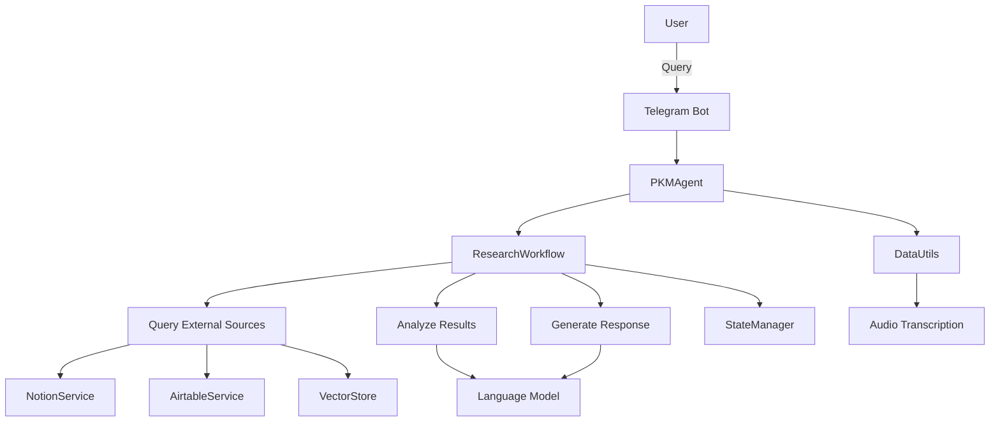

# AGENT_PKM Architecture

## Overview

AGENT_PKM is built with a modular architecture to ensure flexibility, maintainability, and extensibility. The system is composed of several key components that work together to process user queries and generate informative responses.

## Key Components

1. **Agents**: The core logic for processing queries and managing the overall flow of information.
   - `PKMAgent`: The main agent responsible for handling user interactions and orchestrating the research process.

2. **Components**: Reusable modules that provide specific functionalities.
   - `Memory`: Manages the vector store for efficient similarity search of embedded documents.

3. **Services**: Integrations with external data sources and APIs.
   - `NotionService`: Handles querying and retrieving information from Notion databases.
   - `AirtableService`: Manages interactions with Airtable for data retrieval.

4. **Utils**: Utility functions and helpers.
   - `DataUtils`: Provides functions for processing data, including audio transcription.

5. **State**: Manages the state of the research workflow.
   - `StateManager`: Handles the storage and retrieval of state information during the research process.

6. **Workflows**: Defines the research process and manages the flow of information.
   - `ResearchWorkflow`: Implements the step-by-step process of querying, analyzing, and generating responses.

## System Flow

1. User sends a query (text or voice) via Telegram.
2. The `PKMAgent` receives the query and initiates the research process.
3. The `ResearchWorkflow` orchestrates the following steps:
   a. Query external sources (Notion, Airtable) and personal data (vector store).
   b. Analyze and synthesize the results.
   c. Generate a final response.
4. The response is sent back to the user via Telegram.

## Diagram

This architecture allows for easy extension of functionality by adding new services, components, or modifying the research workflow as needed.
